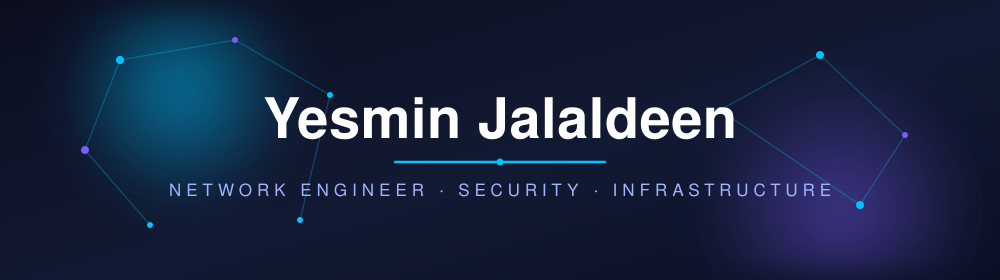

  

 

## 🌐 Future Network Engineer · Enterprise Networking · Network Security · Infrastructure

 

-1D4ED8?style=for-the-badge)

---

# 🚀 About Me

### Network Engineering Undergraduate · BIT (Hons.) in Computer Networks · 🇱🇰 Sri Lanka

| | |
|:--|:--|
| 🎯 **Mission** | Turning topology designs into secure, scalable, and resilient enterprise infrastructure. |
| 📚 **Skilled in** | Enterprise Network Security, Routing & Switching, VPN Technologies, Infrastructure Design, Cybersecurity |
| 💙 **Passionate About** | Designing enterprise networks, Secure infrastructure. Real-world implementation, Solving networking challenges |
| 🚀 **Goal** | To become a skilled Network Engineer building secure, scalable, and resilient enterprise infrastructure. |

---

# 💬 Quote of the Moment

---

  
# 🌐 Networking Arsenal

## 🌍 Enterprise Networking

## ⚡ Routing Technologies

## 🔀 Switching Technologies

## 🔐 Network Security

## 🌐 Network Services

## 🖥️ Virtualization & Platforms

## ☁️ Cloud & Automation

## 📶 Wireless Networking

---

# 📊 GitHub Analytics

   
  
   

---

# 📈 Contribution Activity

  

---

# 🌐 Let's Connect

---

━━━━━━━━━ ✦ ━━━━━━━━━

### ✍️ **Yesmin Jalaldeen**
*Future Network Engineer · Building secure, scalable networks from Sri Lanka 🇱🇰*

**"Every strong business starts with a strong network."**

⭐ *Always learning · Always building · Always improving* ⭐

━━━━━━━━━ ✦ ━━━━━━━━━

